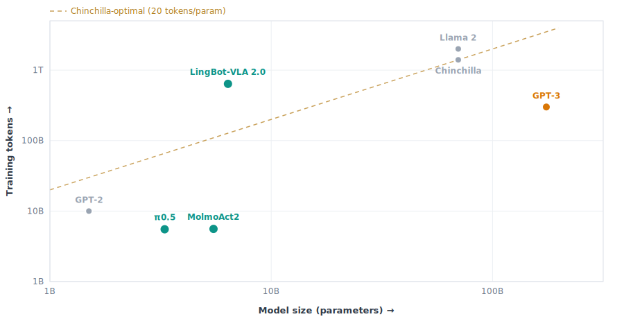

# Scale Estimator

A single-file tool for one blunt question about robot models: **how scaled are they, really?**

It plots a model's **parameters vs. training tokens** against some seminal LLMs (GPT-2, GPT-3, Chinchilla, Llama 2), with the Chinchilla-optimal line, so you can see how data-starved a model is for its size.

Counting robot data in tokens is tricky: in text every word is new, but at 30 fps frame N+1 is nearly a copy of frame N. So it shows two numbers: **naive** (count every frame) and **effective** (only what's new, set by the `novelty` slider).

## Usage

Open `index.html` for the overview: every model plotted against the LLM landmarks. Click one to open its detail page (`model.html`), where you can edit the assumptions and see the numbers move. Hover the chart anywhere for a params/tokens read-off. Compute uses `C ≈ 6·N·D·epochs`.

Model values live in `data.js`. Edit the numbers as you read a paper, or add another entry and it shows up on the overview and in the dropdown.

## Files

- `index.html` — overview graph, all models
- `model.html` — per-model detail page (editable)
- `data.js` — the model values
- `scale.js` / `style.css` — shared math/plotting and styles
- `build-graph.js` — regenerates the README image: `node build-graph.js`
